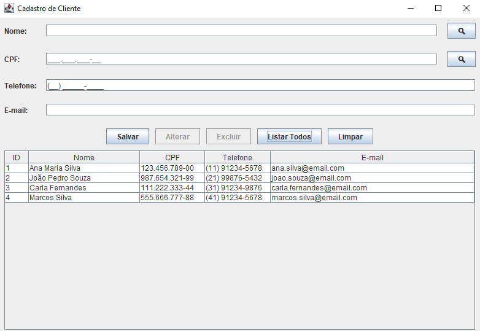
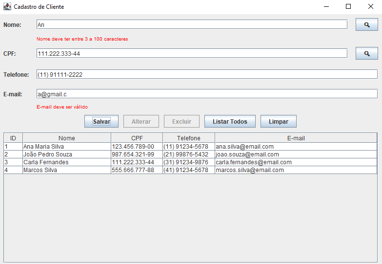

# Aplicação de Cadastro de Clientes - Teste Prático

Esta aplicação foi desenvolvida como parte de um **teste prático de um processo seletivo**.
Seu objetivo é demonstrar o uso de Java com interface gráfica **(Swing)** para implementar uma tela de cadastro de clientes com funcionalidades completas de **CRUD** (criar, ler, atualizar e deletar),
integrando uma **base de dados** e **validações de entrada**.

Apesar de o [enunciado](https://github.com/wastecoder/spring-swing-cliente/blob/main/docs/Enunciado.pdf) solicitar o uso do **MySQL**,
optei por utilizar o **H2 Database** para facilitar a instalação e execução, mantendo toda a lógica de persistência e manipulação de dados.

A aplicação foi estruturada utilizando o **Spring com Maven** para melhor organização e desacoplamento entre as camadas.

---

## Funcionalidades

- [x] Interface com campos: Nome, CPF, Telefone e E-mail.
- [x] Máscaras nos campos de CPF e Telefone.
- [x] Validação dos dados com feedback visual diretamente no formulário.
- [x] Botões para: salvar, alterar, excluir, listar todos e limpar.
- [x] Confirmação antes das ações de alteração e exclusão.
- [x] Filtro de busca por nome (parcial) e por CPF (exato).
- [x] Tabela interativa com os clientes cadastrados (ID, Nome, CPF, Telefone, Email).
- [x] Ao clicar em uma linha da tabela, os dados são carregados no formulário.
- [x] Banco de dados populado com 4 clientes padrão.
- [ ] Integração com banco de dados MySQL.

---

## Imagens do sistema

### Página inicial


### Validação do formulário


---

## Instalação e execução

### Pré-requisitos
- Java 17 ou superior
- Maven

### Utilizando H2 Database

1. Clone o projeto na pasta desejada:
```bash
git clone https://github.com/wastecoder/spring-swing-cliente.git
```

2. Execute a classe **Javafxv1Application** para iniciar a aplicação.
   - O banco de dados **H2** é carregado automaticamente em memória.
   - Já inclui **4 clientes** cadastrados como exemplo.

> Nenhuma configuração adicional é necessária. O projeto está pronto para uso imediato.

### (Opcional) Utilizando MySQL

1. Crie um banco de dados no seu SGBD chamado `clientes`.

2. Edite o arquivo [application.yml](https://github.com/wastecoder/spring-swing-cliente/blob/main/src/main/resources/application.yml), alterando as seguintes configurações:
```yaml
spring:
  datasource:
    url: jdbc:mysql://localhost:3306/clientes
    username: seu_usuario
    password: sua_senha
    driver-class-name: com.mysql.cj.jdbc.Driver
  jpa:
    hibernate:
      ddl-auto: update
    show-sql: true
    database-platform: org.hibernate.dialect.MySQL8Dialect
```

3. A dependência do MySQL já está incluída no `pom.xml`, portanto não é necessário adicioná-la manualmente.

4. Execute a classe **Javafxv1Application** para iniciar a aplicação.
